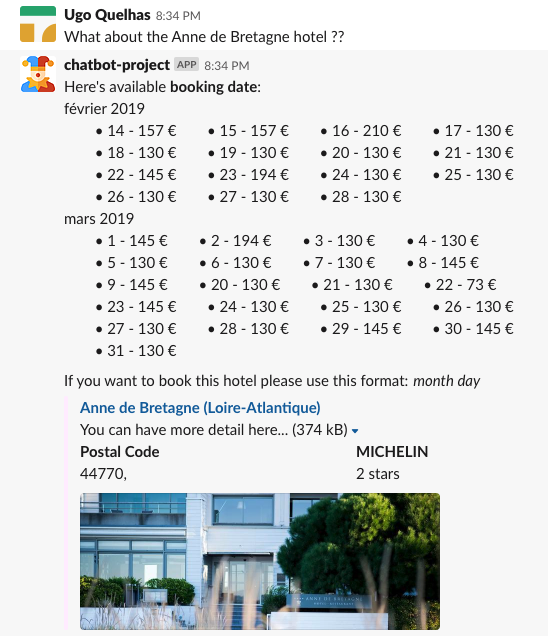

# Castle Valet
> Chatbot Project

A simple chatbot communicating with the [**Castle API**](https://github.com/quelhasu/castle-api) to obtain information and book a hotel as a user.  
This project was built in **Python** and uses the **SlackClient** library to communicate with the user.

## Team
  - **QUELHAS** Ugo
  - **ROUVET** Nicolas

## Database
Simple database to store user and his bookings:
```sql
create table bookings (
  id integer primary key,
  user_id varchar(80),
  hotel_id varchar(100),
  created_at text,
  booking_for text,
  price text
);

create table users (
  id integer primary key,
  user_id varchar(80) unique
);
```

## How it works
The program is based on to two files `slackbot.py` and `database.py`.  
In the first one, there is the all process of the chatbot. The program will read the user input and according several list of pattern (`hello`, `booking`, `information`...) will process it with an acceptable natural understanding.

### Commands examples

#### List best hotels
The program will return a list of best hotels according its `from_price` property.


#### Hotel in specific Location
Given a location, the program will return available hotels at this location.


#### Hotel details
Given the name of a hotel, the program will return the available booking dates and the link to that hotel.


#### Hotel booking
Given a hotel name and available date, the program will save the reservation.
At this moment, user can book for the same hotel for the same date, the API does not allow doing a booking.


#### List user bookings
